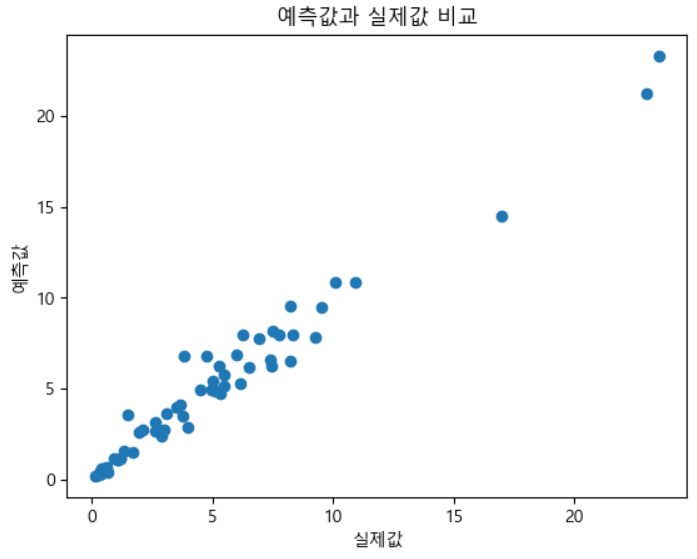
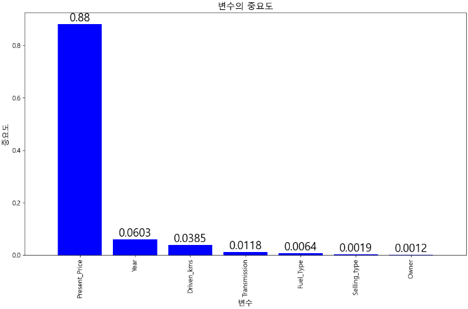
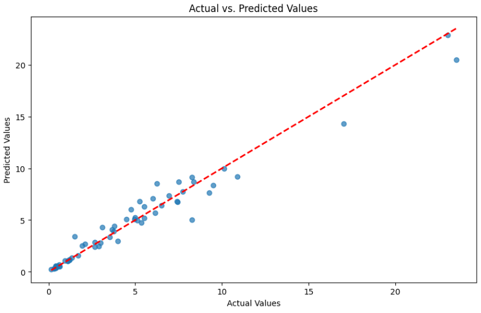
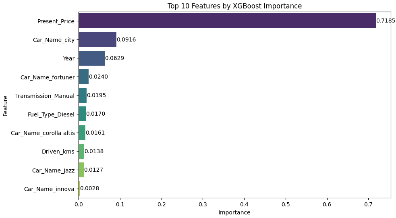

# 중고차 가격 예측 (중고 자동차)

## 소개
이 프로젝트는 다양한 특징을 기반으로 중고 자동차의 판매 가격을 예측하는 데 중점을 두고 있습니다. 데이터셋에는 자동차 모델, 제조 연도, 판매 가격, 현재 가격, 운행 킬로미터, 연료 유형, 판매 유형, 변속기 유형 및 소유자 변경 횟수와 같은 정보가 포함되어 있습니다. 데이터는 Kaggle에서 가져온 것으로, 인도 중고 자동차의 판매와 관련된 데이터입니다. 데이터셋에서 사용된 통화는 인도 루피입니다.

## 데이터셋 상세정보
- **Car_Name**: 모델명
- **Year**: 제조 연도
- **Selling_Price**: 판매 가격
- **Present_Price**: 현재 (원래) 가격
- **Driven_kms**: 운행 킬로미터
- **Fuel_Type**: 연료 유형
- **Selling_type**: 판매 유형
- **Transmission**: 변속기 유형
- **Owner**: 소유자 변경 횟수

- 데이터 개수 : 301

## 예측 모델
### Random Forest Model
- **사용 모델**: 랜덤 포레스트 (회귀)
- **이유**: 제한된 데이터셋 크기(301개 레코드)로 인해 랜덤 포레스트가 효과적으로 작동하는 것으로 선택되었습니다. 부트스트래핑, 랜덤 특성 선택, 앙상블 학습과 같은 알고리즘의 장점을 활용하여 다양한 훈련 데이터 및 특성 조합으로 견고한 예측 모델을 만들 수 있습니다.

- **모델 성능 지표**:
    - R-squared: 0.9660031418818049
    - 평균 제곱 오차 (MSE): 0.7831374986059993
    - 평균 절대 오차 (MAE): 0.5691584699453552

    

- **특성 중요도**:
    - 현재 가격 (88%)
    - 제조 연도
    - 운행 킬로미터
    - 변속기 유형
    - 연료 유형
    - 판매 유형
    - 소유자 변경 횟수
    
    

### XGBoost Model
- **사용 모델**: XGBoost (회귀)
- **이유**: 랜덤 포레스트에 비해 더 복잡한 모델 구조와 효과적인 그래디언트 부스팅 알고리즘을 활용하여 성능을 높이고, 모델의 일반화 능력을 향상시킬 수 있습니다.

- **모델 성능 지표**:
    - 평균 절대 오차 (MAE): 0.5480373593822854

    

- **특성 중요도**:
    - Present_Price: 0.7185
    - Car_Name_city: 0.0916
    - Year: 0.0629
    - Car_Name_fortuner: 0.0240
    - Transmission_Manual: 0.0195
    - Fuel_Type_Diesel: 0.0170
    - Car_Name_corolla altis: 0.0161
    - Driven_kms: 0.0138
    - Car_Name_jazz: 0.0127
    - Car_Name_innova: 0.0028
    

    
## 결론
MAE 평가 지표를 본다면 XGBOOST가 0.548로 0.569보다 낮으나 실제로 큰 차이가 나지 않는 것으로 보이며 이는 데이터 부족으로 인해 큰 차이가 나지 않는 것으로 보입니다.
XGBOOST고 랜덤포레스트 모델을 통해 중고 자동차의 구매 또는 판매에 관한 의사 결정을 지원할 수 있습니다.

다음 변수를 알면 중고 자동차의 판매 가격을 예측할 수 있습니다:
- Car_Name(XGBOOST만)
- Year
- Selling_Price
- Present_Price
- Driven_kms
- Fuel_Type
- Selling_type
- Transmission
- Owner